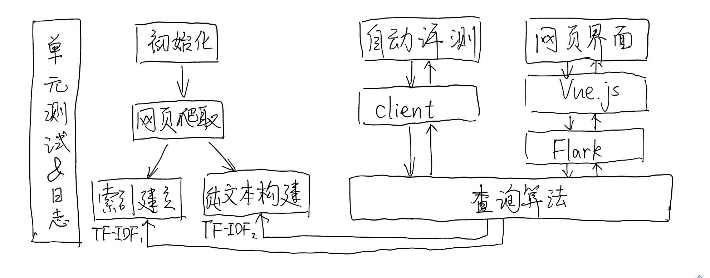
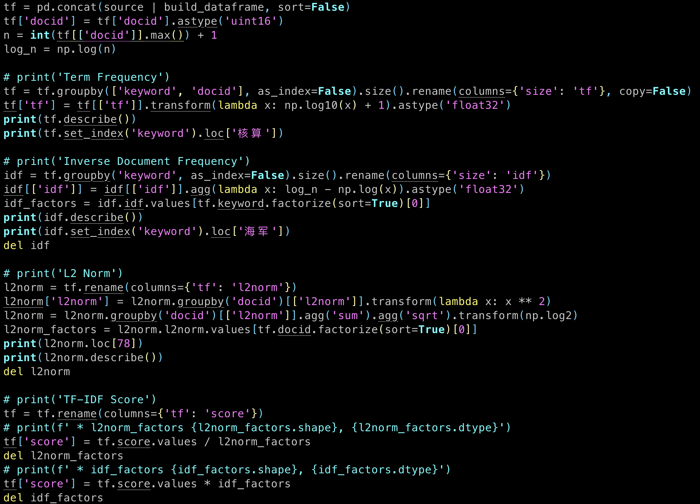
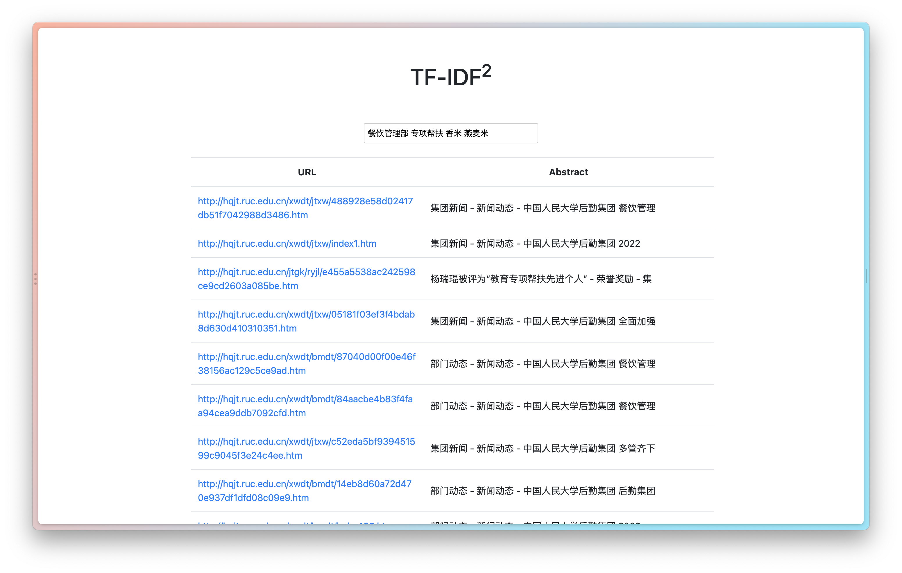

# $TF-IDF^2$: An Effective Search Engine

## 整体介绍

$TF-IDF^2$ 是一个基于两次 TF-IDF 查询的本地高效搜索引擎，包含从网页爬取、索引建立、自动评测到网页界面一系列功能。第一次 TF-IDF 查询采用细粒度、低精度索引，进行初步筛选；第二次 TF-IDF 查询在结果的基础上采用粗粒度、高精度查询，重新进行排序。为了实现 `Vue.js` 网页界面的实时查询，在实现上，本项目利用`pipe`、`pandas`、`numpy`等库的管道、半精度计算等功能，达到高效处理。同时工程实现、单元测试与日志、`Flark` 服务端等保证项目稳定运行。所有代码及生成的文件（不包括课程课件等）开源在[Github](https://github.com/huyiwen/search_engine)中。

我们发现仅使用一次 `TF-IDF` 无法处理困难查询，如查询词不同顺序、完整查询句。这是倒排索引过小的词切分带来的问题。直接应用搜索将避免过小的词切分，但导致效率极度低下。因此我们引入了两次 `TF-IDF` ，在第一次倒排索引查询的基础上，再进行第二次搜索查询，对 `Long-Term` 采用类似的算分方式再次小范围排序。至此在兼顾效率的同时有效地提升了精度。



最终分数展示：


### 安装与初始化

> 如果您下载的版本已经包含索引文件，您可以跳过python代码的运行。我们可能将在未来的版本中将索引文件从仓库中移除。

```bash
git clone https://github.com/huyiwen/search_engine.git && cd search_engine
pip install -r requirements.txt
cd search_engine
python spider.py
python save_pure.py  # choose tokenize
python build_index.py
python save_pure.py  # choose pure
```

### 快速上手

您可能需要手动安装 `npm` 及某些依赖。

```bash
# command line evaluation
python query.py

# Web UI
cd ../server
flask run > ../log/flask.out 2>&1 &  # to terminate the server process, just close the terminal
cd ../webui
npm run dev
```

### TF-IDF分数计算公式

下面列举了两次计算分数所采用的公式。选用的原由详细记录于日志手册及 `git` 历史中。

- `Term-Frequency` 采用对数词频率： $\log_{10}(tf)+1$
- `Inverse-Document-Frequency` 采用对数逆文档频率： $\ln(N/df)$
- `L2 Norm` 采用对数L2范数： $\log_2\left(\sqrt{x_1^2+\cdots+x_n^2}\right)$
- `Phased-Score` 使用 `TF-IDF` 分数计算余弦相似度： $\cos(\mathbf{q},\mathbf{d})=\sum{\mathbf{q}_i\ \cdot\  \mathbf{d}_i}\ /\ L2Norm(\mathbf{d})$
- `Long-Term-Frequency` 采用平滑的对数词频率： $\log_{10}(ltf+9)$
- `Inverse-Document-Frequency` 采用放缩的平滑对数逆文档频率： $\log_{10}(N/df+9)\ /\ \max(\mathrm{TF\mbox{-}IDF}_{long~terms}) \times \max(\mathrm{TF\mbox{-}IDF}_{short~terms})$
- `Final-Score` 使用排除重复词的两次 `TF-IDF` 之和： $\mathrm{TF\mbox{-}IDF}_{short~terms}+\mathrm{TF\mbox{-}IDF}_{long~terms}$

### 日志手册及核心亮点

您可以在 `git` 提交历史中查询到完整的日志手册及对应的代码。对应的页面和索引文件也包含在其中。我们在这里列举一些核心问题。包括爬虫在内的所有的代码仅供学习使用，请勿用于商业或非法用途。

- 用户代理。我们的爬虫在某些页面会遇到反爬虫技术。这是由于服务器过滤异常请求头。我们引入 `fake_useragent` 绕过了该问题。
- 网页爬取。我们观察到某些页面的子页面无法正常爬取。调取爬虫日志发现，获得的子页面的网址与实际网址有所区别。例如爬取页面 `http://hqjt.ruc.edu.cn/canyin/` 的子页面时会发生 `404` 错误。我们发现子页面网址的 `path` 会丢失 `canyin/`项。这是由于 `urllib.parse.urljoin` 会将 `canyin` 视为一个文件并切换到上级目录，而浏览器会正常跳转至 `canyin/index.htm` 显示。我们采用相同的方式修复了该问题。
- 网页处理。我们发现页面包含大量页眉和页脚，可能影响查询效率。我们使用正则表达式高效搜索和移除这些标签，他们包含
- 分词。我们发现 `pkuseg` 拥有较好的 `F1-Score` ，但应用在构建索引中效果并不好。我们发现，在分词时因为其正确率“比人类高”，某些人类分词错误的短语并不能很好查询。如搜索“海军”并不能返回正确结果，因为在原文中正确的分词应该是“海军部”。我们可以采用融合词向量或者更换分词方式修复该问题。最终我们将分词改用 `jieba.lcut_for_seach` 作为修复方式。
- 分数计算。我们发现某些文档中即使某个词频率很高，该文档的 `TF-IDF` 分数依然低于其他文档。我们发现对文档进行归一化时，文档长度抑制了文档得分。虽然文档词频较高，但文档长度较长，导致分数远低于平均。所以我们修改了文档归一化的方式，使用对数文档长度，有效避免文档长度带来的问题。
- 文档分数。我们认为，对于某个词，在单一文档中词频率提升带来的影响，应小于在所有文档中文档频率提升带来的影响。我们对于对数采用了不同的底数。实验表明对数逆文档采用以 $e$ 为底的查询准确度高于以 $10$ 为底。
- 平滑的对数频率。在第二次 `TF-IDF` 分数计算中，我们采用的对数频率相较于第一次更为平滑。我们认为这样能提升长查询的整体分数，提升长查询所占得权重。
- 困难查询预警。在查询中我们认为第一条结果和第二条结果的分数比较能较好说明查询难度。较难的查询将导致前两条结果分数接近。因此我们对与分数差小于 $140\%$ 的查询通过 `logging` 进行预警，协助优化模型。

## 实现流程与代码细节

实现流程包括网页爬取、索引建立、纯文本构建、自动评测和网页界面。您可以在项目框架图中找到更详细的信息。也可以在初始化与快速上手中找到流程代码。

### 项目结构

```text
search_engine
├── assets           # 项目资源
├── report           # 实验报告
├── index            # 索引文件
├── json             # URL与DOCID映射文件
├── pure             # 纯文本文件
├── saved_pages      # HTML和分词文件
├── search_engine    # 搜索代码
│   ├── spider.py            # 爬虫
│   ├── build_index.py       # 构建索引
│   ├── save_pure.py         # 构建纯文本文件
│   ├── query.py             # 查询
│   ├── client.py            # 自动评测
│   ├── process.py           # utils
│   ├── reverse_dict.py      # utils
│   ├── init_logger.py       # logging
│   ├── test_get_links.py    # unitest
│   ├── test_get_scores.py   # unitest
│   ├── test_tokenize.py     # unitest
│   └── test_url2str.py      # unitest
├── server           # 服务端代码
└── webui            # 前端代码
```

### 代码细节

本项目利用 `pipe` ，将 `R` 和 `bash` 引以为傲的管道符融合在了项目中，兼顾代码简洁与效率。构建索引速度高达 $1000it/s$ 。


同时利用 `pandas` 及其半精度计算加速分数计算速率及内存占用。



## 界面展示

服务器端采用 `Flask` 构建，前端采用 `Vue.js` 构建。支持高效实时查询、可访问URL显示、自动摘要抓取、结果相关性排序等功能。



## 致谢

- 由衷地感谢中国人民大学高瓴人工智能学院赵鑫教授精彩授课以及三位课程助教耐心的帮助。

- 感谢[developing-a-single-page-app-with-flask-and-vuejs](https://github.com/xitu/gold-miner/blob/master/TODO1/developing-a-single-page-app-with-flask-and-vuejs.md)对于构建界面展示的启发性作用。

    
